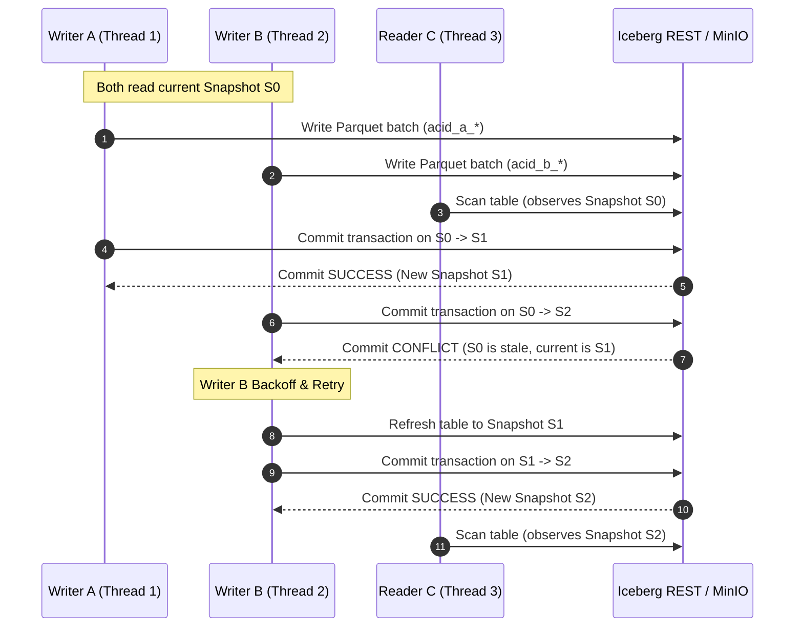

# Apache Iceberg ACID Audit — Concurrent Writers & Reader

## Overview

In the IceStream Lakehouse architecture, **Apache Iceberg** serves as the transactional table format providing **ACID guarantees** on top of MinIO (S3-compatible object storage). This document details the architectural mechanisms and audit procedures used to validate **Atomicity, Consistency, Isolation, and Durability** on the `bronze.checkout_events` table under heavy concurrent workloads.

---

## 1. Concurrency Architecture & Test Harness

The Day 13 ACID Audit implements a multi-client concurrency test harness:

```text
                    ┌────────────────────────┐
                    │  bronze.checkout_events│
                    │   (Apache Iceberg V2)  │
                    └───────────┬────────────┘
                                │
        ┌───────────────────────┼───────────────────────┐
        ▼                       ▼                       ▼
┌──────────────┐        ┌──────────────┐        ┌──────────────┐
│   Writer A   │        │   Writer B   │        │   Reader C   │
│ (500 records)│        │ (500 records)│        │  (Continuous │
│ acid_a_<uuid>│        │ acid_b_<uuid>│        │  Snap Scans) │
└──────────────┘        └──────────────┘        └──────────────┘
```

### Components

1. **Writer A (`tests/acid/writer_a.py`)**:
   - Generates a controlled batch of **500 checkout events** with `event_id` prefix `acid_a_<uuid>`.
   - Populates realistic fields (`currency: USD`, `payment_method: credit_card`, `amount: Decimal(18,2)`).
   - Executes optimistic concurrency retries with randomized backoff upon commit collisions.

2. **Writer B (`tests/acid/writer_b.py`)**:
   - Generates a controlled batch of **500 checkout events** with `event_id` prefix `acid_b_<uuid>`.
   - Populates realistic fields (`currency: EUR`, `payment_method: paypal`, `country: DE`).
   - Executes concurrently with Writer A with automated conflict resolution.

3. **Reader C (`tests/acid/reader_c.py`)**:
   - Background worker continuously polling table snapshot state, summary metrics, and record counts.
   - Verifies **Snapshot Isolation**: Reader C never blocks writers, never experiences query failures, and only reads immutable snapshot states.

4. **Master Audit Orchestrator (`scripts/day13_acid_audit.py`)**:
   - Captures **BEFORE**, **DURING**, and **AFTER** states across metadata and physical storage.
   - Performs a catalog durability test by restarting the `iceberg-rest` catalog container and validating table lineage integrity.

---

## 2. Apache Iceberg ACID Guarantees

### A — Atomicity (All-or-Nothing Snapshots)
- **Mechanism**: Iceberg writes data to immutable Parquet files in MinIO first, builds manifest files and manifest lists, and only makes the entire batch visible through an atomic commit swap of `metadata.json` via the REST catalog.
- **Verification**: If a commit succeeds, exactly 500 records appear in the table. If a commit fails or is in-progress, 0 records from that batch are visible. Partial writes or dirty reads are physically impossible.

### C — Consistency (Schema & Metadata Integrity)
- **Mechanism**: Every record is validated against the 14-field Iceberg V2 schema (`NestedField` types, timestamps with microsecond precision, Decimal precision `(18, 2)`).
- **Verification**: Snapshot metadata summaries (`added-records`, `total-records`, `added-data-files`) match physical row counts exactly. No schema drift or orphaned corrupted records.

### I — Isolation (Snapshot Isolation & Optimistic Concurrency Control)
- **Mechanism**:
  - **Snapshot Isolation**: Readers query against the current snapshot ID at the moment the scan is initiated. Readers are completely lock-free and never block concurrent writers.
  - **Optimistic Concurrency Control (OCC)**: Writers stage data optimistically. When committing, the Iceberg REST catalog performs an atomic compare-and-swap (CAS). If another writer committed first (advancing the table's snapshot), the second writer detects the conflict, re-reads table metadata, and retries the commit without data loss.
- **Verification**: Reader C ran concurrent queries with 0 failures during simultaneous writes by Writer A and Writer B. Commit conflicts were automatically detected and resolved via retries (0 for Writer A, 1 for Writer B), resulting in all 1,000 records committing cleanly.

### D — Durability (Persistent Catalog & Object Storage)
- **Mechanism**: Table data files reside in MinIO (`s3://warehouse/bronze/checkout_events/data/`), while hierarchical metadata (`metadata.json`, manifests) is persisted to `s3://warehouse/bronze/checkout_events/metadata/`.
- **Verification**: The audit forcefully restarted the `icestream-iceberg-rest` container. Following restart, `bronze.checkout_events` was reloaded, all snapshots were intact, and the latest committed snapshot ID remained active and fully queryable.

---

## 3. Optimistic Concurrency Control (OCC) Flow



---

## 4. Durability & Recovery Strategy

When the Iceberg REST catalog or Lakehouse ingestion service restarts:

1. **Metadata Discovery**: The REST catalog resolves the latest `metadata.json` version file in MinIO.
2. **Snapshot Chain Reconstruction**: The complete parent-child snapshot tree is rehydrated from manifest lists.
3. **Zero Data Loss**: Uncommitted data files are ignored (available for vacuum/orphan cleanup), while all committed snapshots remain immutable.

---

## 5. Audit Results Summary

| Guarantee | Target Metric | Observed Result | Status |
|---|---|---|---|
| **Atomicity** | Batch size = Committed size (500/500) | Exactly 500 records committed per writer | **PASS** |
| **Consistency** | Schema conformity & zero duplicate IDs | 0 schema violations, 0 duplicate test UUIDs | **PASS** |
| **Isolation** | Reader zero errors, OCC retry success | Reader C: 0 failures, Writer B: 1 retry | **PASS** |
| **Durability** | Post-restart snapshot and table accessible | Snapshot intact after REST service restart | **PASS** |

