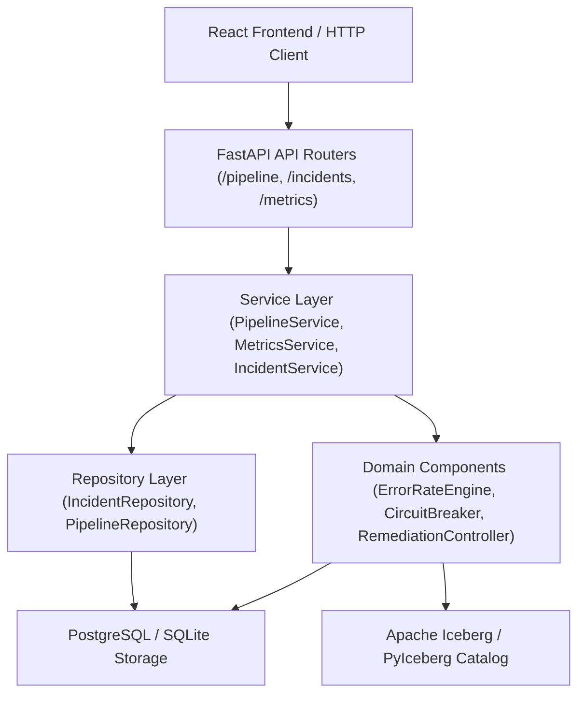

# IceStream Backend Architecture

This document describes the layered architecture of the IceStream FastAPI Observability Backend and Pipeline Control service.

---

## Architectural Principles

1. **Transport Layer Separation**: FastAPI acts purely as an API/transport layer. It contains **no business logic** for error-rate calculation, circuit-breaker state transitions, self-healing remediation, data-quality validation, or schema comparison.
2. **Authoritative Domain Components**:
   - `PipelineStateManager`: Owns authoritative pipeline state (`RUNNING`, `PAUSED`, `CIRCUIT_OPEN`, `REMEDIATING`, `REFETCHING`, `REPROCESSING`, `VALIDATING`, `RESUMING`, `RECOVERY_FAILED`, `RECOVERED`).
   - `CircuitBreaker`: Owns circuit state (`CLOSED`, `OPEN`, `HALF_OPEN`) and processing permission rules.
   - `ErrorRateEngine`: Owns 1m and 5m rolling window metrics and data health classification (`HEALTHY`, `WARNING`, `CRITICAL`).
   - `RemediationController`: Orchestrates the 7-stage self-healing workflow.
   - `QualityEngine`: Executes custom rules and Great Expectations suites.
   - `SchemaDriftDetector`: Compares baseline and actual event schemas.
   - `StorageBackend` / Repositories: Handles PostgreSQL persistence with SQLite fallback for unit tests.

---

## End-to-End Control and Data Flow



---

## Control Flow Examples

### 1. Manual Resume Safety Flow (`POST /pipeline/resume`)

```
HTTP POST /pipeline/resume
   ↓
PipelineRouter
   ↓
PipelineService.resume()
   ↓
Check CircuitBreaker.state
   ├─ [If OPEN] → HTTP 409 Conflict ("PIPELINE_PROTECTED")
   └─ [If CLOSED] → PipelineStateManager.transition_to(to_state=RUNNING) → HTTP 200 OK
```

### 2. Remediation Execution Flow (`POST /pipeline/recover`)

```
HTTP POST /pipeline/recover
   ↓
PipelineService.recover()
   ↓
Check PipelineStateManager.get_state()
   ├─ [If REMEDIATING/REPROCESSING] → Return 200/202 ("ALREADY_RUNNING")
   └─ [If Eligible] → RemediationController.execute_remediation()
         ↓
    1. Verify Quarantine persistence
    2. Dispatch Alert (Slack/Mock)
    3. Re-fetch Source (LocalSourceAdapter)
    4. Reprocess via QualityEngine
    5. Validate error rate
    6. Transition CircuitBreaker (HALF_OPEN → CLOSED)
    7. Resume Pipeline (RUNNING) & Mark Incident RECOVERED
```
