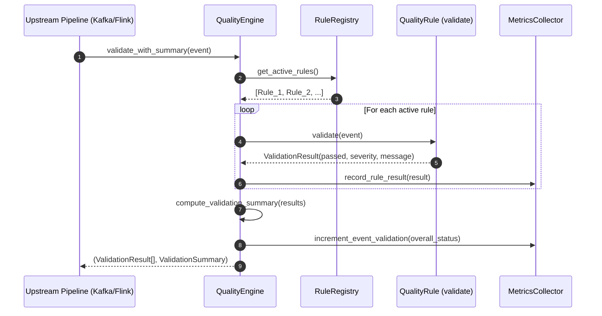

# IceStream Quality Engine Architecture & Design

**Phase 4 — Observability Engine | Day 14: Quality Engine Architecture**

---

## 1. Executive Summary

The **Quality Engine** is the foundational real-time evaluation framework of IceStream designed to validate streaming events against data quality rules, isolate rule execution failures, summarize event health, and provide metrics hooks for downstream circuit breaking and lakehouse quarantine routing.

---

## 2. Architecture & Data Flow

```
                Event
                  │
                  ▼
          ┌───────────────┐
          │ QualityEngine │
          └───────┬───────┘
                  │
                  ▼
            Rule Registry
                  │
        ┌─────────┼─────────┐
        ▼         ▼         ▼
      Rule A    Rule B    Rule C
        │         │         │
        └─────────┼─────────┘
                  ▼
         ValidationResult[]
                  │
          ┌───────┴───────┐
          ▼               ▼
       Metrics         Summary
```



---

## 3. Core Principles

1. **Rule Isolation**: A failure or unexpected exception in any rule never stops remaining rules from evaluating the event.
2. **Standardized Contract**: All rules implement `validate(event) -> ValidationResult` with uniform severity and field diagnostics.
3. **Pluggable Architecture**: New rules subclass `QualityRule` and register dynamically via `registry.register()` or `@register_rule` without modifying engine source code.
4. **Declarative Configuration**: Rules can be dynamically enabled, disabled, and have their severity levels overridden via YAML configuration.
5. **Decoupled Responsibilities**: The engine evaluates quality; transport (Kafka), streaming state (Flink), storage (Iceberg), and alerting (Slack) remain independent consumers.

---

## 4. Models & Status Definitions

### Severity Matrix
| Severity | Description | Action Impact |
| :--- | :--- | :--- |
| `CRITICAL` | Severe schema or identifier defect (e.g., missing `event_id`) | Marks event status as `FAILED` |
| `HIGH` | Significant business data violation (e.g., negative amount) | Marks event status as `FAILED` |
| `MEDIUM` | Domain violation (e.g., unknown payment method) | Marks event status as `WARNING` |
| `LOW` | Minor anomaly or non-critical formatting discrepancy | Marks event status as `WARNING` |
| `INFO` | Informational diagnostic check | Preserves `HEALTHY` status |

### Event Evaluation Status
- **`HEALTHY`**: All active quality rules passed.
- **`WARNING`**: One or more low/medium severity rules failed, but no high/critical rules failed.
- **`FAILED`**: One or more high or critical severity rules failed.

---

## 5. Demonstration Rule: `EventIdNotNullRule`

The initial demonstration rule validates the presence and non-emptiness of the `event_id` field:

```python
class EventIdNotNullRule(QualityRule):
    @property
    def name(self) -> str:
        return "event_id_not_null"

    @property
    def default_severity(self) -> Severity:
        return Severity.CRITICAL

    def validate(self, event: QualityEvent) -> ValidationResult:
        event_id = event.event_id
        if event_id is None or str(event_id).strip() == "" or str(event_id).strip().lower() == "none":
            return ValidationResult(
                rule_name=self.name,
                passed=False,
                severity=self.severity,
                message="event_id is null, empty, or unpopulated",
                field="event_id",
                event_id=None,
                metadata={"provided_value": event_id},
            )
        return ValidationResult(
            rule_name=self.name,
            passed=True,
            severity=self.severity,
            message="event_id is present and valid",
            field="event_id",
            event_id=str(event_id),
            metadata={"provided_value": event_id},
        )
```

---

## 6. Verification and Test Coverage

The Quality Engine test suite validates:
- Event schema parsing and tolerant deserialization
- ValidationResult model serialization and status properties
- Severity and EventStatus aggregation logic
- Abstract rule contracts and custom rule implementations
- RuleRegistry registration, deduplication, unregistration, and lookup
- Dynamic `@register_rule` class decorator behavior
- QualityEngine execution on valid and invalid event fixtures
- Multi-rule execution and rule failure isolation
- Rule exception handling and crash containment
- YAML configuration loading, validation, and severity overrides
- Thread-safe metrics collector operations
